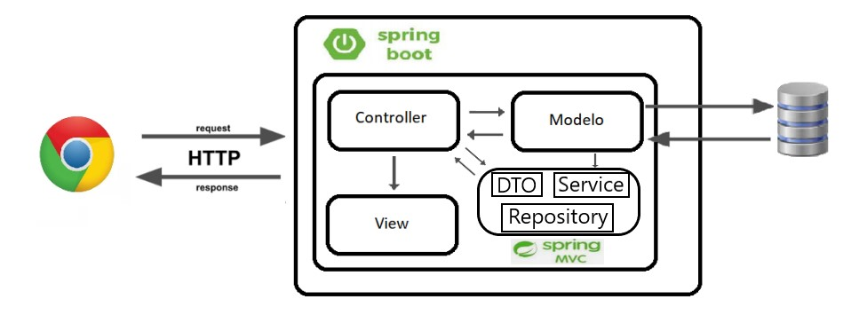

# Projeto TCC II - MusicHarmony

Este é o projeto da disciplina TCC, foi desenvolvido o sistema web abordando sobre teoria musical de nível básico:

- Aulas: Conceito Musical, Tríade, Tétrade e Transposição;
- Identificar as notas que compõem p acorde de tríade e tétrade;
- Transpor a nota/acorde;
- Pesquisa de acordes.

## Objetivo
O objetivo principal deste trabalho foi apresentado a proposta de desenvolvimento de
uma aplicação web para auxiliar os músicos iniciantes a consultar além das aulas apresentadas,
identificar as notas de acorde tríade, identificar as notas de acorde tétrade, identificar o acorde/-
nota transposta e pesquisa de diagrama de acorde.

## Arquitetura de projeto

